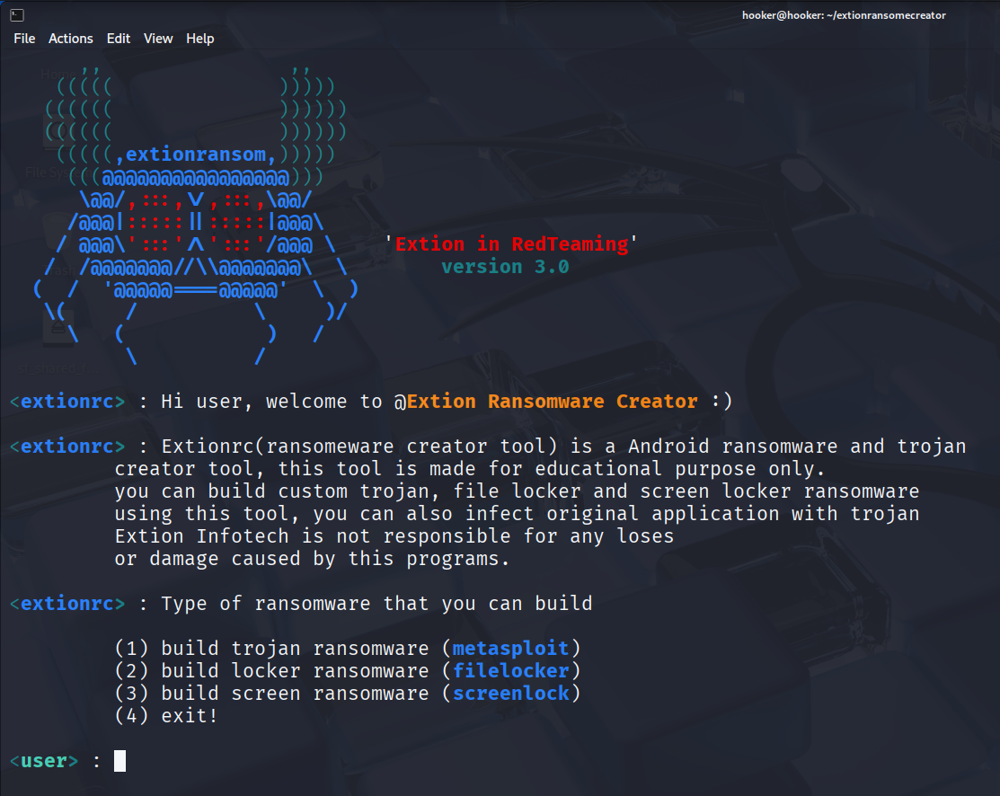
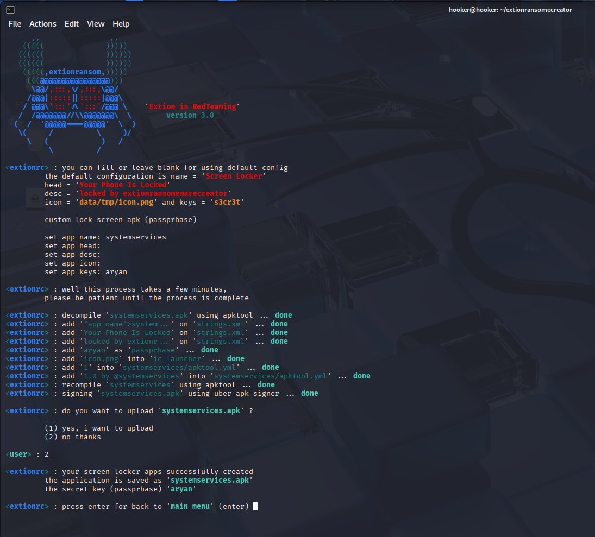

# <p align="center">Disclaimer

<b>This tool is provided for educational and research purpose only. Extion infotech is not responsible for any misuse of this tool. 
We use it to test under NDA agreements with clients and their consents for pentesting purposes and we never encourage to misuse or take responsibility for any damage caused !
#
# Extion Infotech Ransomeware Creator Tool - Extionrc 
# This tools is developed by Extion infotech for testing and practicing of Cybersecurity interns 

<p align="center"> 

# <p align="center">About

<p align="center">
<a href="https://www.extioninfotech.com/"></a>
</p>

ExtionRansomCreator is a simple tool to create Trojan or Ransomware for Android devices
# <p align="center">Disclaimer
This tool is made for education purpose only, the author is not responsible for any loses or damage caused by this programs
# <p align="center">Installation
* Kali Linux, Ubuntu, Debian, Termux (proot-distro: Ubuntu)
```bash
git clone https://github.com/extioninfotech/extionransomecreator.git && cd extionransomecreator && sudo bash install.sh && python3 extionrc.py
```
# <p align="center">Demo
* Generate Custom Trojan (metasploit)



* Generate Custom locker




<h2 align="center">
  <a href="https://docs.google.com/forms/d/e/1FAIpQLSevJAasjy4LYz9iuAzcTZu7oppCqni7uoVxzVSDm5pNVp17ww/viewform?pli=1" target="_blank">Extion Infotech Internships</a>
</h2>

<p align="center">
We offer a wide range of services, including:

Trainings – Industry-focused skill development programs.
Internships – Hands-on experience in various technical domains.
Staffing & Placements – Career assistance and recruitment solutions.
Software & Web Development – Custom software, web, and app development.
Digital Marketing & Promotion – SEO, social media marketing, and lead generation.
Branding & Design – Creating strong and memorable brand identities.

# <p align="center">You can click below image
</p>

<p align="center">

<a href="https://docs.google.com/forms/d/e/1FAIpQLSevJAasjy4LYz9iuAzcTZu7oppCqni7uoVxzVSDm5pNVp17ww/viewform?pli=1" target="_blank">
  
</a>

### Credit's
Copyright © 2025 by [Extion Infotech](https://extioninfotech.com)
